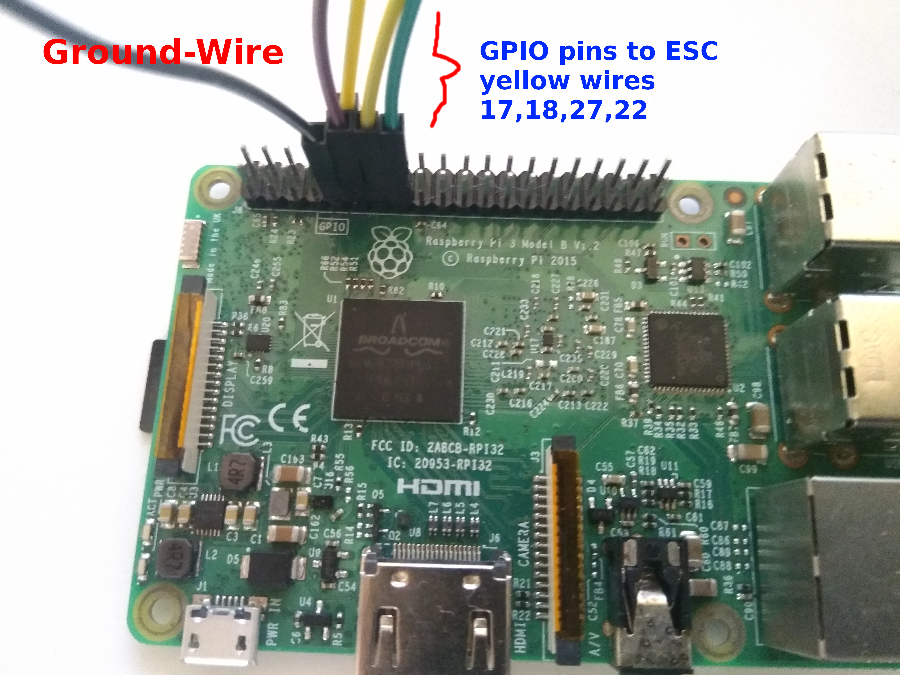
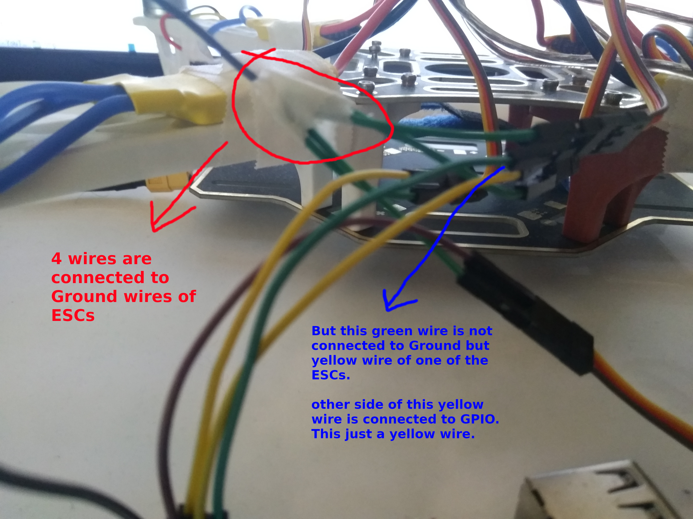
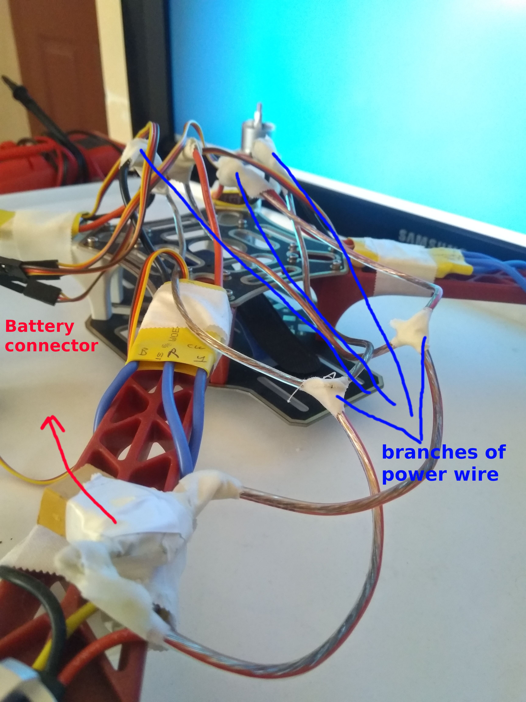

# Raspberry-Pi-Multiple-ESC-Calibration-for-Drone

I derived this code from a code for controlling one ESC with pressing the keys a,q,e,d.

This code is to control 4 motors with ESC.

My ESC pins on the Raspberry Pi are 11,12,13 and 15, GPIO 17, 18, 27 and 22 respectively:

My Ground wire is connected on the pin 9. It branched into 4 wires to ground wires of ESCs:

Battery sould be disconnected before writting "kal" then press the key "ENTER". Battery connector wire is connected with ESCs by branches:

In this version, speeds of motors are the same in any time.

[In this video](https://youtu.be/HeMyoC2pJfA) I increased and decreased speeds of the motors. Then stop it with writting "stop". 
